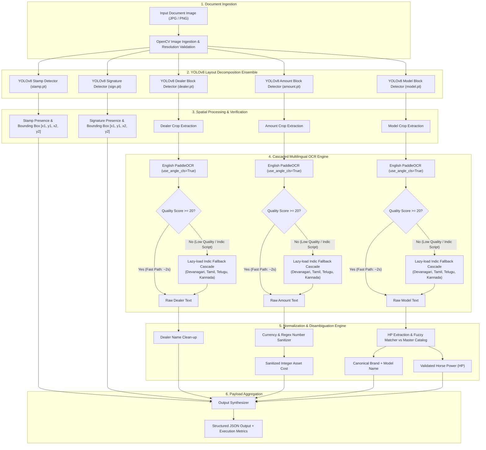
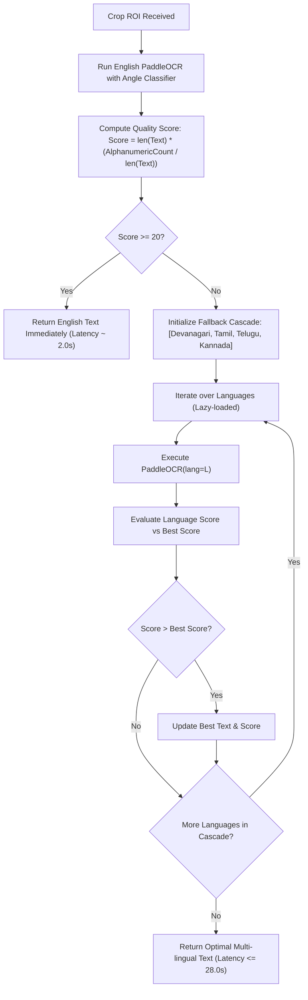
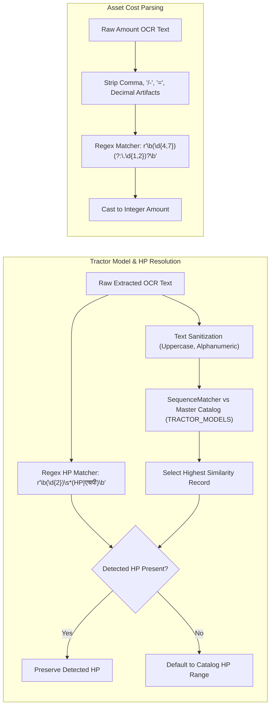
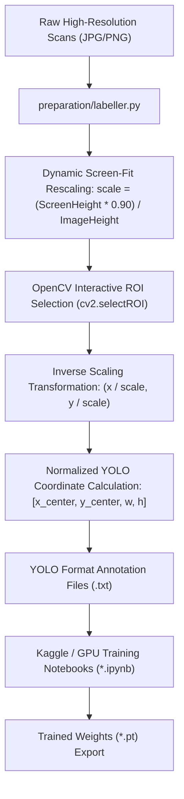

# Architecture Documentation: Intelligent Document AI for Field Extraction

## Overview

The Intelligent Document AI system is an end-to-end, multi-stage document processing pipeline engineered to extract structured fields and verification artifacts from tractor loan quotation documents, invoices, and financial receipts. The system is designed to handle noisy document scans, heterogeneous layouts, multilingual scripts (English, Devanagari/Hindi, Tamil, Telugu, Kannada), and variations in typography.

The architecture decouples layout detection from textual recognition, employing a hybrid topology:
1. A modular ensemble of five fine-tuned YOLOv8 object detection models for visual localization of regions of interest (ROIs).
2. A priority-driven, cascaded multilingual Optical Character Recognition (OCR) engine based on PaddleOCR with lazy-loaded Indic language models.
3. A rule-based post-processing, regex, and fuzzy string normalization subsystem with a master vehicle catalog.

---

## High-Level System Architecture

The following diagram illustrates the complete execution pipeline from raw document image ingestion to final structured JSON output.

---

## Detailed Subsystem Breakdown

### 1. Vision and Layout Decomposition Subsystem

Rather than relying on a single monolithic detector that suffers from class imbalance across divergent aspect ratios, the layout analysis module employs five specialized YOLOv8 nano detectors. Each model is fine-tuned on targeted annotations to optimize bounding box precision and spatial localization.

| Model Name | Target Object | Input | Task Type | Purpose |
| :--- | :--- | :--- | :--- | :--- |
| `stamp.pt` | Official Stamp / Seal | Full Document Image | Object Detection | Verification of physical document authentication. |
| `sign.pt` | Authorized Signature | Full Document Image | Object Detection | Verification of signatory presence and bounding box localization. |
| `dealer.pt` | Dealer Header / Block | Full Document Image | Object Detection | Bounding region isolation for dealer business entity text. |
| `amount.pt` | Quotation Total / Asset Cost | Full Document Image | Object Detection | Bounding region isolation for numerical transaction amount. |
| `model.pt` | Vehicle Model Description | Full Document Image | Object Detection | Bounding region isolation for tractor make, variant, and horsepower. |

#### Inference Configuration
- **Confidence Threshold**: `conf = 0.25`
- **Intersection Over Union (IoU)**: Internal Non-Maximum Suppression (NMS) applied per model.
- **Bounding Box Format**: `[x1, y1, x2, y2]` in absolute pixel coordinates.

---

### 2. Cascaded Multilingual OCR Engine

The OCR engine balances high throughput with multilingual coverage across Indian regional scripts. Processing is organized in a priority cascade.

#### Mathematical Quality Metric
The heuristic scoring function evaluates character density and alphanumeric integrity:

$$\text{Quality Score}(T) = \text{len}(T) \times \left( \frac{\sum_{c \in T} \mathbb{I}[c \in \text{Alphanumeric}]}{\max(\text{len}(T), 1)} \right)$$

- If the English OCR text satisfies $\text{Quality Score} \ge 20$, execution exits in approximately 2.0 seconds.
- If the score falls below the threshold (typical for documents in Hindi, Tamil, Telugu, or Kannada), the engine systematically evaluates each Indic language model, returning the highest-scoring candidate within a maximum processing window of 28.0 seconds.

---

### 3. Entity Extraction and Normalization Subsystem

#### Master Tractor Catalog Disambiguation
The system maintains a comprehensive dictionary of Indian tractor manufacturers and variants, including:
- Swaraj (Code, Target, 717, 724 XM, 735 FE, 744 FE, 855 FE, 963 FE, etc.)
- Mahindra (OJA series, YUVRAJ, JIVO, XP PLUS, SP PLUS, YUVO TECH+, ARJUN, NOVO)
- TAFE (Orchard Plus, Dynatrack, 42 DI, 5900 DI, etc.)
- Sonalika (Tiger, Sikander, Worldtrac series)
- Escorts / Farmtrac / Powertrac / Digitrac
- John Deere (D series, E series)
- New Holland (Simba, TX series)
- Kubota, Force, Preet, VST, Captain, ACE, Indo Farm, HMT, Eicher, Standard

Fuzzy matching is computed using Ratcliff-Obershelp similarity via Python's `difflib.SequenceMatcher`:

$$\text{Similarity}(S_1, S_2) = \frac{2 \times M}{|S_1| + |S_2|}$$

where $M$ is the number of matching characters within non-overlapping maximal common substrings.

---

### 4. Data Preparation and Annotation Architecture

The training data pipeline includes a custom desktop annotation utility for fast spatial labeling under Windows screen scaling constraints.

---

## Runtime Performance Analysis

| Processing Path | Document Language / Condition | Average Latency | Bottleneck Components |
| :--- | :--- | :--- | :--- |
| Fast Path | Clear English quotations | ~2.0 seconds | YOLOv8 inference + 1x English PaddleOCR pass |
| Indic Fallback | Devanagari / Hindi quotations | ~6.0 - 12.0 seconds | YOLOv8 + English OCR + Devanagari PaddleOCR |
| Full Cascade Fallback | Complex Indic / Multilingual quotations | Max 28.0 seconds | YOLOv8 + Sequential evaluation across 4 Indic models |

### Confidence Metric Formulation
The aggregate confidence score returned per document represents the arithmetic mean of all detected bounding box confidence scores across all five YOLOv8 detector instances:

$$\text{Document Confidence} = \frac{1}{N} \sum_{i=1}^{N} \text{conf}_i$$

where $N$ is the total count of active bounding boxes identified across all sub-models.
